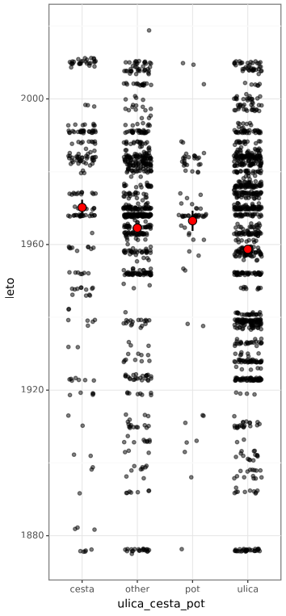

Examine Ljubljana's street history
==================================

A small set of scripts that scrape the Ljubljana's street names and dates
when they were founded. The analyis is based on whether the name
contains "cesta" (road), "pot" (path) or "ulica" (street).

Start with `fetch_geckodriver.py`, then get the data using `scrape_lj_ulice.py`
and finally run `process_lj_ulice.py` to get the final plot.

